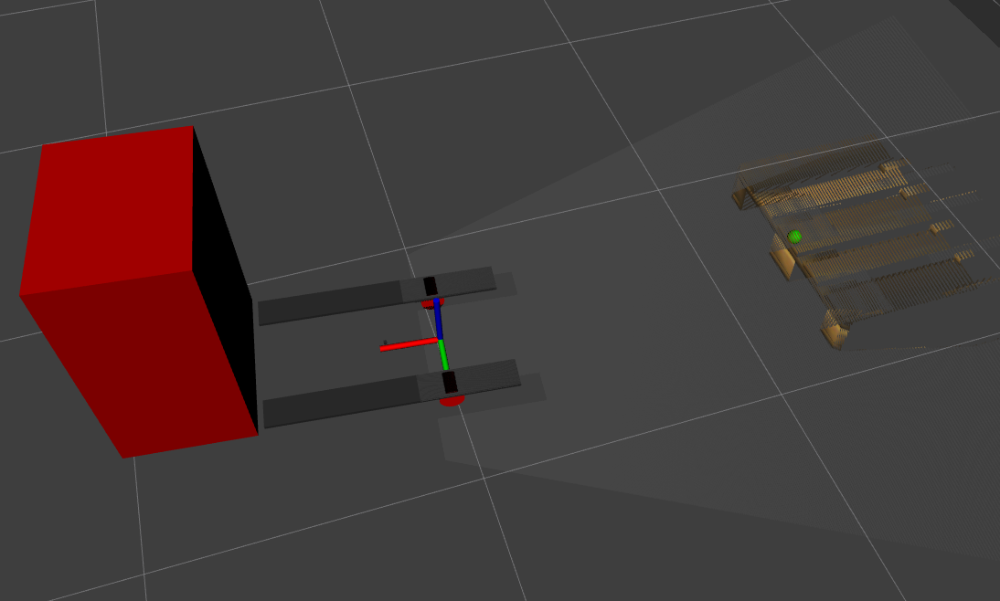

# Special pallet detection system

A project is made in ROS noetic with using PCL liblary. Cititruck's elements were taken from [navigation_oru](https://github.com/OrebroUniversity/navigation_oru-release) project and adapted for own demands.
Packages allow to find a pallet position, base on center of a perpendicular plane, and show it as a rviz marker.



## Files description and run
All launch files are in `spds_launch` package directory. To run the project use command 
```
roslaunch spds_launch truck_with_pallet_web.launch
```

It is opporiunity to launch the project with `tmux:= true` what allow to monitor running launch files in the project. 


A pallet detection part is in `spds_perception` directory, espectially in `spds_pallet_recognision` source files.
